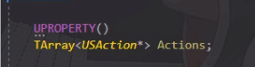
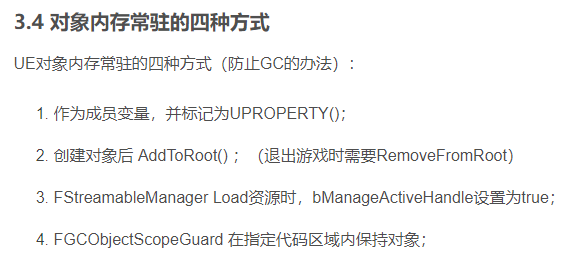
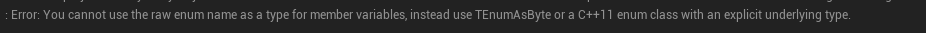
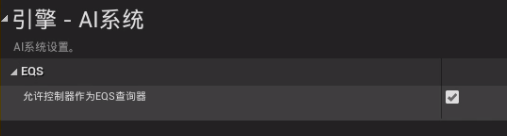
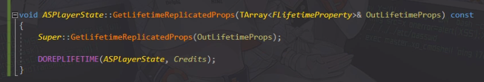
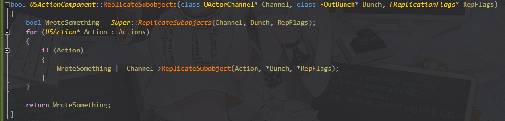

#虚幻引擎UEC++笔记

---------------------
[TOC]

-------------------

## 虚幻各种坑
- 重复绑定委托代理报错 `Verify same function isn't already bound`, 绑定的函数和委托代理同名导致, 为了避免这种情况定义的函数名称应该跟委托名称不同 （似乎只在ai character中出现过）
-  使用`NewObj<T>()`创建对象应该加上`UPROPERTY()`防止垃圾回收
- 
-  原始枚举类型通过`UPROPERTY()`暴露给蓝图报错 使用`TEnumAsByte<T>` 或 `emun class`

## 调试相关
- 日志
	- 打印日志 `UE_LOG(LogTemp, Warning, TEXT(""))`
	- 在视口打印日志 `GEngine->AddOnScreenDebugMessage(Key,  Time, FColor,  "")`
	- 在场景中输出字符串 `DrawDebugString(GetWorld(), Location, "", nullptr, FColor, size, true)`
	- 格式创建FString `FString::Printf(TEXT(""), Args)`
- 控制台
	- 命令`UFUNCTION(Exec)`
	- 变量 
		- 声明 `static TAutoConsoleVariable<T> Var("[prefix.]name", DefaultValue, "Desc", ECVF_Cheat)`
		- 使用 `GetValueOnGameThread()`
	- 作弊系统 CheatManager
- 显示调试图形 `DebugDrawLine() DebugDrawSpher()`等等

## 映射
- 函数会有执行引脚，像`GetValue()`这种函数应该加上`const`限定符，这样就不会有执行引脚
- 如果函数参数是`T&`引用类型，在蓝图中将会显示输出节点，如果只想显示输入节点加`const`限定符，`const T&`
- 在创建对象时显示输入引脚 `UPROPERTY(BlueprintReadWirte, mate = (ExposeSpawn)) `

## GamePlay框架
####GameMode
- 获取GameMode`GetWorld()->GetAuthGameMOde<T>()`
- 角色重生`RestartPlayer`

#### Component
- 启用TickComponent `PrimaryComponentTick.bCanEverTick = true`

#### Actor
- 启用Tick `PrimaryActorTick.bCanEverTick = true`
- N秒后自动销毁 `SetLifeSpan(N)` 
-  获取眼睛位置和旋转 `GetActorEyesViewPoint(Location, Rotation)`

#### Controller
- 解除controller和pawn的绑定 `UnPosses()`

#### pawn
- 通过重写`GetPawnViewLocation()`返回相机位置，使得在第三人称游戏中`GetActorEyesViewPoint()`返回正确位置

#### GameState
- 存储游戏数据

#### PlayState
- 存储玩家数据

## UI
- `UPROPERTY(meta = (BindWidget))` 在控件蓝图中需要绑一个同名同类型的控件
- 创建Widght  `CreateWidget<T>(GetWorld(), TSubClassOf<T>)`
- UI 附加到场景并朝向玩家
	- `UGameplayStatics::ProjectWorldToScreen(ScreenPosition)` 由世界场景位置获取屏幕位置，如果在屏幕外将返回false
	- `Scale = UWidgetLayoutLibrary::GetViewportScale()` 获取视口缩放比例
	- `Widget->SetRenderTranslation(ScreenPosition/Scale)`

## AI
#### AIController (AI控制器)
- ai控制器主要起到载体的作用，可以很容易的获取黑板
- `AIController::RunBehaviorTree()`启动行为树
- `GetBrainComponent()->StopLogic()`停止行为树
####BehaviorTree (行为树)
- 行为树是AI的大脑，控制AI的行动逻辑
####Blackboard (黑板)
- 黑板是AI存储数据的地方
####EQS (Environment Query System 环境查询系统)
- EQS需要到项目设置打开 
- C++ 中使用EQS 
	- `QueryInstance = UEnvQueryManager::RunEQSQuery` 异步执行，需要通过返回值`QueryInstance`绑定回调函数
	- `QueryInstance->GetOnQueryFinishedEvent()` 获得委托代理

####PawnSensingComponent (感知组件)
- `PawnSensingComponent` 是传统做法，目前也是支持的

#### AIPerceptionComponent (感知组件）
- 官方更推荐的AI感知方案， 在性能和灵活性方面比`PawnSensingComponent `更好

## Tag
- 在某些方面可以更好替代`bool` `enum` `struct`
- 标签 `FGameplayTag` 标签容器 `FGameplayTagContainer` 
- 例如找到钥匙打开房门简单逻辑，在不使用背包系统，或者在人物蓝图中保存是否捡到钥匙的bool变量，使用Tag会更加灵活而且更好维护

## 网络
#### 网络复制
- 状态复制 `UPROPERTY(Reliable|Unreliable|ReplicatedUsing)`
	- Reliable: 可靠的，类似TCP，属性状态一般是Reliable 例如:人物血量，是否存活等，但是也不是绝对的，人物当前位置可能使用Unreliable更好，因为当前位置是一直更新的
	-  Unreliable: 不可靠的，类似UDP,  修饰性的东西一般是Unreliable  例如: 播放声音，粒子特效
	-  设置网络复制后需要在cpp文件中实现函数 `GetLifetimeReplicatedProps()`
	
- UObject 复制要做额外工作
	-  被复制的对象要重写函数 `IsSupportedForNetworking()` 返回 `true`
	-  在该对象拥有者中重写函数 `ReplicateSubobjects()`
	-  USAction继承UObject，这个例子是复制一个Tarray<USAction*> 
	 

-  当发生网络复制时调用指定函数 `UPROPERTY(ReplicatedUsing="OnRep_FunctionName")` OnRep_前缀非必要的，但推荐这么做
-  动态生成的Actor可以复制到所有客户端 `Actor::SetReplicates(true)`
-  组件设置网络复制 `UActorComponent::SetIsReplicatedByDefault(true)`

#### RPC
- 是否拥有权限 `HasAuthority()` 在服务器中执行返回`true` 客户端返回 `false`
- 判断本地控制器 `Pawn::IsLocallyControlled()` 
- `UFUNCTION(Server|Client, ...)` Server 只在服务器执行 Client 只在客户端执行
- 组播 `UFUNCTION(NetMulticast, Reliable|Unreliable)`

## 其他
- 布娃娃 
	`GetMesh()->SetAllBodiesSimulatePhysics(true)`
	`GetMesh()->SetCollisionProfileName("Ragdoll")`
- `TSubClassOf<T>` 在编辑器中限定只能选择类型T和它的子类